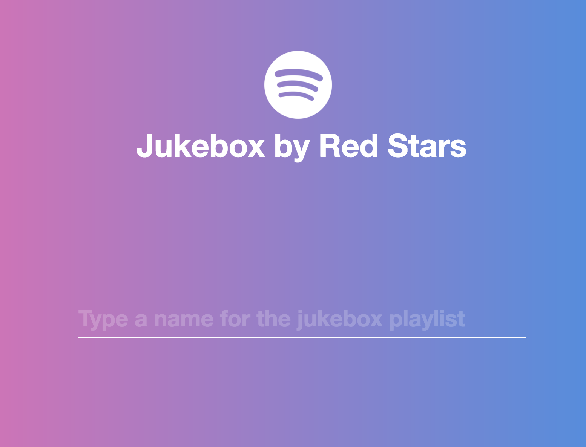
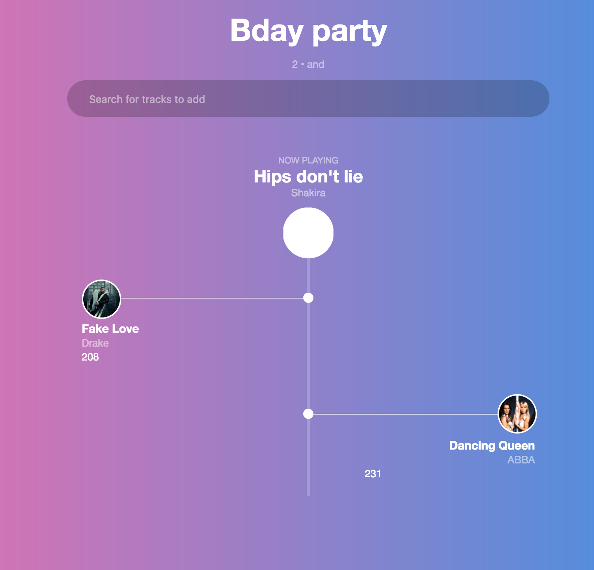

# Party jukebox

A party playlist generator using Spotify connect API

One clients token is used by the backend to create private playlists for that user.

Other clients do not need to have Spotify account in order to add songs.

